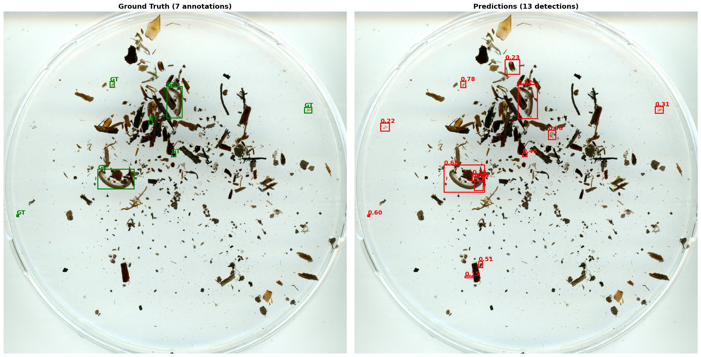
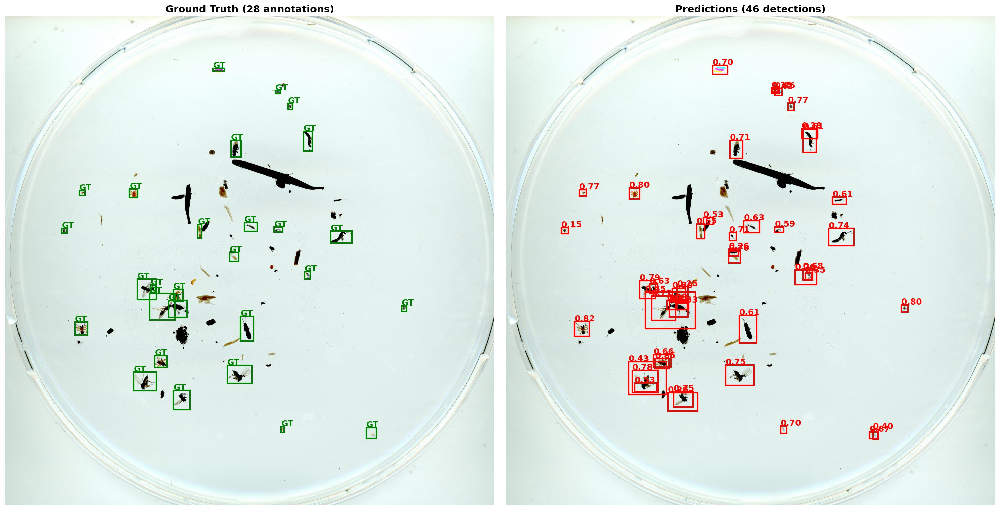
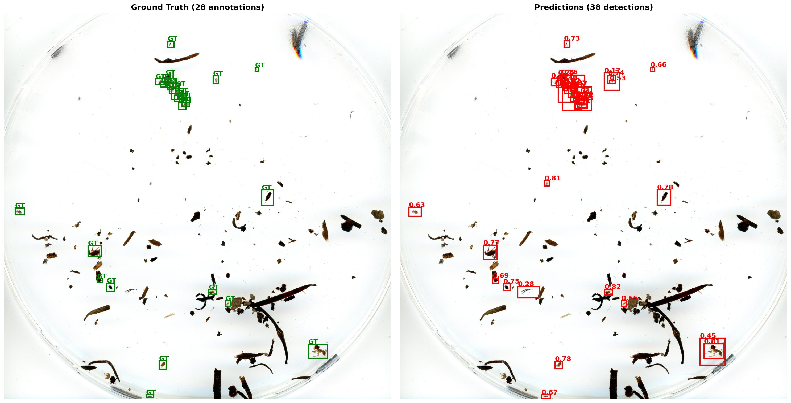

# Arthropod Detection Pipeline

An AI-powered system for automatically detecting and counting arthropods in petri dish photographs using computer vision techniques.

**Key capabilities:**
- **Automatic Detection**: Finds and marks arthropods in photographs without human input
- **High Accuracy**: Achieves 90% recall (finds 9 out of 10 creatures) with good precision
- **Fast Processing**: Analyzes large images in minutes instead of hours
- **Rotation Handling**: Can identify creatures regardless of their orientation in the image
- **Multiple Species**: Works with various arthropod types (beetles, spiders, ants, etc.)

## How It Works

The system uses an object detection model (YOLOv11 medium) combined with a technique called SAHI (Slicing Aided Hyper Inference) to process high-resolution petri dish images:

1. **Image Preparation**: Large petri dish photos are divided into smaller, overlapping tiles
2. **AI Detection**: A trained neural network examines each tile to find arthropods
3. **Result Combination**: Detections from all tiles are merged to create the final result
4. **Validation**: The system compares its findings against human-annotated ground truth

## Performance Results

Our system has been tested on 29 test images containing 565 arthropods total:

- **Recall**: 90% (correctly identifies 9 out of 10 arthropods)
- **Precision**: 51% (about half of detections are correct)
- **F1-Score**: 65% (balanced measure of accuracy)

**Why the lower precision?** The system is optimized to find as many arthropods as possible (high recall) rather than being overly conservative. This means it sometimes identifies non-arthropod objects as creatures, but it rarely misses actual arthropods.

## Example Results

Here's a side-by-side comparison showing the system's performance:





*Left: Ground truth annotations (green boxes), Right: AI predictions (red boxes with confidence scores)*

## Technical Pipeline

The system consists of 7 main processing steps:

### 1. Data Preparation (`00_prep_env.py`)
Downloads arthropod images and annotation data from cloud storage, setting up the local environment for processing.

### 2. Quality Visualization (`01_plot_batch.py`)
Creates visualization batches showing annotated image crops to verify data quality and annotation accuracy.

### 3. Dataset Splitting (`02_establish_data_splits.py`)
Divides the dataset into training (70%), validation (20%), and test (10%) sets while ensuring consistent distribution across arthropod classes.

### 4. Individual Crop Extraction (`03_process_crops.py`)
Extracts individual rectangular thumbnails for each annotated arthropod, handling rotation.

### 5. Training Data Preparation (`04_yolo_prep.py`)
Converts data into YOLO format and creates tiled datasets:
- Training images: 1280×1280 tiles with 50% overlap (for variety)
- Validation images: 1280×1280 tiles with 10% overlap
- Test images: Resized to 5120px (no tiling)

### 6. Model Training (`05_yolo_train.py`)
Trains the YOLOv8 object detection model using standard techniques:
- 100 epochs with early stopping
- AdamW optimizer with cosine learning rate scheduling
- Standard data augmentations (mosaic, flip, HSV adjustments)

### 7. Inference and Evaluation (`06_inference.py`)
Performs SAHI inference on test images with comprehensive evaluation:
- Sliced inference for handling large images
- IoU-based matching between predictions and ground truth
- Detailed metrics calculation and visualization

## Installation and Usage

### Prerequisites
- Python 3.8 or higher
- CUDA-compatible GPU (recommended)
- Google Service Account credentials (for data download)

### Setup
```bash
# Clone the repository
git clone <repository-url>
cd arthropod-detection

# Create conda environment
conda env create -f environment.yml
conda activate arthropod

# Set up Google credentials
export GOOGLE_SERVICE_ACCOUNT_FILE="path/to/your/credentials.json"
```

### Running the Pipeline
Execute the scripts in order:

```bash
# 1. Download data
python 00_prep_env.py

# 2. Visualize data quality
python 01_plot_batch.py

# 3. Create dataset splits
python 02_establish_data_splits.py

# 4. Extract individual crops (optional)
python 03_process_crops.py

# 5. Prepare YOLO dataset
python 04_yolo_prep.py

# 6. Train the model
python 05_yolo_train.py

# 7. Run inference and evaluation
python 06_inference.py
```

## File Structure

```
arthropod-detection/
├── data/                          # Data storage
│   ├── raster/                   # Image files
│   │   ├── petri_dish_src/       # Original petri dish images
│   │   └── crops/                # Individual arthropod crops
│   ├── tabular/                  # Annotation and metadata
│   │   ├── annotations.json      # Bounding box annotations
│   │   └── split_map.json        # Train/val/test assignments
│   └── yolo_dataset/             # YOLO-format training data
├── models/                       # Trained model weights
├── results/                      # Output visualizations and metrics
│   ├── sahi_inference/          # Inference results
│   │   ├── comparisons/         # Side-by-side visualizations
│   │   ├── metrics/             # Performance metrics
│   │   └── summary_report.html  # Detailed results report
│   └── training_metrics.png     # Training progress plots
└── scripts/                     # Main processing pipeline
    ├── 00_prep_env.py           # Data preparation
    ├── 01_plot_batch.py         # Quality visualization
    ├── 02_establish_data_splits.py  # Dataset splitting
    ├── 03_process_crops.py      # Crop extraction
    ├── 04_yolo_prep.py          # YOLO dataset preparation
    ├── 05_yolo_train.py         # Model training
    └── 06_inference.py          # Inference and evaluation
```
** ToDo's 
Currently the pipeline detects all bugs, and is not sensitive to species. I plan to stack a classifier on to the detector to attain species-level metrics.